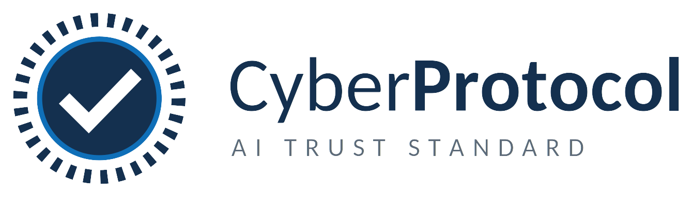

<div align="center">



### A Neutral Global Framework for AI Identity, Provenance, and Compliance Verification

[](https://creativecommons.org/licenses/by/4.0/)
[](LICENSE)
[](#status)
[](https://www.oneplanetoneearthfoundation.org)
[](https://github.com/ryanpaulpillas/cyberprotocol-ai-trust-standard)

[Website](https://cyberprotocol.io) · [Whitepaper](https://cyberprotocol.io/whitepaper.html) · [Repository](https://github.com/ryanpaulpillas/cyberprotocol-ai-trust-standard) · [Governance](#governance) · [Contributing](#contributing)

</div>

---

## Overview

**CyberProtocol** is an open, neutral, cryptographic framework that verifies **who** created an AI, **what** it produced, that it is **safe**, and that it **complies** with the law, across every jurisdiction.

Three concurrent mandates now demand verifiable AI: **EU AI Act** enforcement, the founding of **WAICO**, and the **Rome Declaration** by Nobel Laureates. Yet no harmonized, cross-border verification standard exists. CyberProtocol fills that gap as a **global public good**, not controlled by any nation, corporation, or bloc.

This repository holds the **specification** and the **open-source reference implementation** of the Standard.

> **We are not inventing new cryptography.** CyberProtocol unifies proven, mature standards (W3C DID/VC, ZK-SNARKs, CBOR/Data Integrity signatures) into one coherent, interoperable framework.

---

## The Four Pillars

| # | Pillar | Question it answers | Core mechanism |
|---|--------|---------------------|----------------|
| 1 | **AI & Human Identity** | *Who or what is acting?* | Decentralized Identifiers (DID) extended for AI agents (`did:cyber:agent`); W3C Verifiable Credentials for humans |
| 2 | **Provenance & Output Certification** | *Where did this come from?* | An immutable cryptographic seal on every output, with an optional zero-knowledge mode |
| 3 | **Safety & Risk Compliance** | *Does it meet legal requirements?* | Compliance metadata mapped to EU AI Act, NIST AI RMF, and ISO/IEC 42001 |
| 4 | **Cross-Border Verification** | *Is this proof valid everywhere?* | A neutral, openly verifiable seal format not tied to any national scheme |

Every competitor builds *pieces*. CyberProtocol is designed to connect all four layers into one system.

---

## Concepts

> The examples below illustrate the **proposed** data formats. They document the specification; a working reference implementation is under active development (see [Status](#status)).

### AI agent identity

An AI agent is identified by a DID bound to its model, version, and operator:

```
did:cyber:agent:z6Mkf5rGMoatrSj1f4CyvuHBeXJELe9RPdzo2PKGNCKVtZxP
```

Its DID Document declares the operator, the model it is bound to, and the public key used to sign outputs:

```json
{
  "id": "did:cyber:agent:z6Mkf5rGMoatrSj1f4Cyvu...",
  "controller": "did:web:example-lab.org",
  "model": { "name": "example-llm", "version": "3.1", "release": "2026-05-01" },
  "verificationMethod": [{
    "id": "#sign-key-1",
    "type": "Multikey",
    "publicKeyMultibase": "z6Mkf5rGMoatrSj1f4Cyvu..."
  }]
}
```

### Output provenance seal

Every AI response, file, or transaction can carry an immutable seal:

```json
{
  "@context": "https://cyberprotocol.io/ns/v1",
  "type": "CyberSeal",
  "issuer": "did:cyber:agent:z6Mkf5rGMoatrSj1f4Cyvu...",
  "created": "2026-08-05T09:30:00Z",
  "subject": { "digest": "sha-256:8f434346648f6b96df89dda901c5176b10a6d83961dd3c1ac88b59b2dc327aa4" },
  "config": { "hash": "sha-256:2c26b46b68ffc68ff99b453c1d30413413422d706483bfa0f98a5e886266e7ae" },
  "compliance": { "euAiAct": "limited-risk", "nistRmf": "measured", "iso42001": "attested" },
  "proof": {
    "type": "DataIntegrityProof",
    "cryptosuite": "ecdsa-jcs-2019",
    "proofValue": "z58DAdFfa9SkqZMVvx..."
  }
}
```

A **zero-knowledge option** lets an operator prove a seal's origin and compliance *without* revealing model configuration or other trade secrets.

### Verifying a seal (proposed API)

```bash
# CLI (planned)
cyberprotocol verify ./response.json
# → ✓ Seal valid · issuer did:cyber:agent:z6Mk… · EU AI Act: limited-risk
```

```js
// Library (planned)
import { verifySeal } from "@cyberprotocol/verify";

const result = await verifySeal(seal, { resolver: "https://resolver.cyberprotocol.io" });
if (result.valid) {
  console.log(`Verified output from ${result.issuer} (${result.compliance.euAiAct})`);
}
```

---

## Built on existing standards

| Layer | Standard | Status |
|-------|----------|--------|
| Identity | [W3C Decentralized Identifiers (DID)](https://www.w3.org/TR/did-core/) | Mature |
| Credentials | [W3C Verifiable Credentials (VC)](https://www.w3.org/TR/vc-data-model/) | Mature |
| Privacy | Zero-Knowledge Proofs (ZK-SNARKs) | Production-ready |
| Compliance | EU AI Act · NIST AI RMF · ISO/IEC 42001 | Reference documents exist |
| Signatures | [W3C Data Integrity](https://www.w3.org/TR/vc-data-integrity/) / CBOR | Standardized |

---

## Getting started

```bash
# Clone the repository
git clone https://github.com/ryanpaulpillas/cyberprotocol-ai-trust-standard.git
cd cyberprotocol-ai-trust-standard

# Read the specification (the source of truth)
$EDITOR spec/README.md

# Explore the proposed data formats
cat examples/cyber-seal.json
cat examples/did-agent.json
```

> There is no build step yet: the reference implementation is in early development
> (see [Status](#status)). For now this repository is the specification, the JSON-LD
> contexts, and worked examples. Contributions are welcome, see [CONTRIBUTING](CONTRIBUTING.md).

---

## Repository structure

```
cyberprotocol-ai-trust-standard/
├── spec/           # The written specification (source of truth)
├── contexts/       # JSON-LD contexts and schemas (ns/v1)
├── reference/      # Reference implementation (verifier + issuer)
├── examples/       # Sample DIDs, seals, and compliance metadata
└── docs/           # Guides and integration notes
```

> Directories are populated as the reference implementation matures. Contributions to any of them are welcome.

---

## Status

CyberProtocol is at **v1.0, Initial Proposal**. The specification is published; the reference implementation is in early development. It is proposed now so that adoption, review, and implementation can proceed in parallel with the regulations already entering force.

| Phase | Milestone |
|-------|-----------|
| **Aug 2026** | Standard proposed to UN ECOSOC · Published to Zenodo & GitHub |
| **Q4 2026** | First reference implementation · Pilot integrations with AI labs |
| **2027** | Formal adoption by nations · Integration into regulatory enforcement |
| **2028+** | Global default: every AI output can carry a CyberProtocol seal |

---

## Contributing

CyberProtocol is a public good and welcomes contributors: implementers, cryptographers, policy experts, and reviewers.

1. Open an [issue](../../issues) to discuss a proposal, question, or bug.
2. Fork the repository and create a feature branch.
3. Submit a pull request describing the change and its rationale.

By contributing you agree that your contributions are licensed under the repository's licenses (see below). Please keep discussion neutral and standards-first; CyberProtocol competes with no existing standard; it unifies them.

---

## Governance

CyberProtocol is designed to be **neutral** and **multi-stakeholder**: no single entity controls the protocol.

- **Official reference:** [cyberprotocol.io](https://cyberprotocol.io)
- **Permanent archive:** Zenodo (DOI-assigned for an immutable timestamp)
- **Stewardship:** One Planet One Earth Foundation Inc., holder of **UN ECOSOC Consultative Status**

---

## License

CyberProtocol uses a dual-license model so the Standard stays a free public good while implementations remain commercially usable:

- **Specification & documentation**: [Creative Commons Attribution 4.0 International (CC BY 4.0)](https://creativecommons.org/licenses/by/4.0/), free in perpetuity.
- **Reference code**: [Apache License 2.0](LICENSE), permissive, commercial use allowed.

---

## Stewardship & Contact

Published and stewarded by **One Planet One Earth Foundation Inc.**, a non-profit holding **UN ECOSOC Consultative Status** (UNDESA Civil Society Database; SEC Reg. CN202004649; DSWD-FO III-L-00002-2023).

- **Website:** https://www.oneplanetoneearthfoundation.org
- **Email:** info@oneplanetoneearthfoundation.org
- **Address:** 16th Floor, SM North EDSA Tower 1, North Avenue cor. EDSA, Quezon City, Philippines

<div align="center">

**The laws of the world have already spoken. CyberProtocol is the instrument to make them work.**

Proposed not as a commercial product, but as a global public good, at [cyberprotocol.io](https://cyberprotocol.io).

</div>
